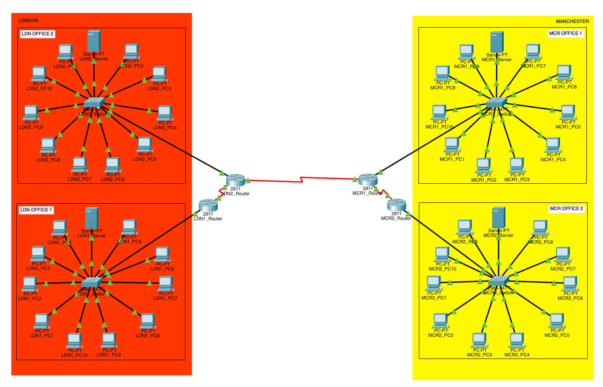

# Fujitsu Network Design

A medium-level network deisgned for Fujitsu, connecting two hypothetical branches in London and Manchester. This project was designed using Cisco Packet Tracer, created for a university project. The project required to include and conduct:

- A systematic layout of the network
- Configuration of SSH network protocals on each router
- A CIDR IP address on each device
- Regular connectivity tests

## Files

- 'FujitsuNetwork.pkt' - Packet Tracer project
- 'Fujitsu-Network.png' - Screenshot of the network topology

## Tools Used

- Cisco Packet Tracer

## Screenshot

  
